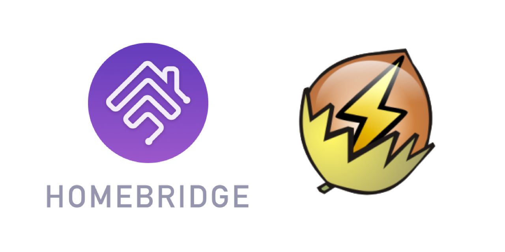

    

# Homebridge UPS

## Homebridge plugin for UPS
Copyright © 2022-2023 Erik Baauw. All rights reserved.

This [Homebridge](https://github.com/homebridge/homebridge) plugin exposes to Apple's [HomeKit](http://www.apple.com/ios/home/) Uninterruptible Power Supply (UPS) devices connected to a host system over [Network UPS Tools (NUT)](https://networkupstools.org).

It provides the following features:
- Monitoring the UPS device from HomeKit:
  - UPS status: on mains power, in use (clients are connected), alarm state, power consumption by connected devices, input voltage, incl. Eve history for power and consumption;
  - Battery: level, voltage, charging state, remaining duration;
- Controlling the UPS device from HomeKit:
  - Enabling or disabling the audible alarm;
  - Setting the low battery threshold;
- Support multiple hosts running `upsd`, support multiple UPS devices per host;
- Includes `ups` command-line utility for troubleshooting.

Homebridge UPS exposes an accessory for each UPS device, with an _Outlet_ service, a _Battery_ service, and a _History_ service for Eve history.
See the [Wiki](https://github.com/ebaauw/homebridge-ups/wiki/UPS-Accessory) for details.

### Prerequisites
Homebridge UPS connects to the socket provided by `upsd` on port 3493.
Before configuring Homebridge UPS, make sure your UPS has been configured correctly.
See the [Wiki](https://github.com/ebaauw/homebridge-ups/wiki/NUT-Setup) for details.

### Configuration
Homebridge UPS needs a list of host systems running `upsd`, specifying the host (IP address or hostname and port), name, and the username/password from `uspd.users` for each system.
See the [Wiki](https://github.com/ebaauw/homebridge-ups/wiki/Configuration) for details.

Best configure Homebridge UPS through the Homebridge UI.

### Command-Line Utility
Homebridge UPS include the `ups` command line utility, to interact with `upsd`.
Run `ups -h` for more info.

### Troubleshooting
Make sure your UPS has been configured correctly, before setting up Homebridge UPS.
See the [Wiki](https://github.com/ebaauw/homebridge-ups/wiki/NUT-Setup) for details.
I do not have the bandwidth to provide support on setting up your UPS.

I developed this plugin for my [APC Back-UPS BE850G2-GR](https://www.apc.com/shop/nl/en/products/APC-Back-UPS-850VA-230V-USB-Type-C-and-A-charging-ports-8-Schuko-CEE-7-outlets-2-surge-/P-BE850G2-GR) devices, connected over USB to the host.
I've connected one of these to a Synology NAS, running DSM 7.1,
and another one to a Raspberry Pi 4B, running Raspberry Pi OS bullseye.
Both systems run NUT protocol version 1.2.

I would expect Homebridge UPS to work with NUT on other systems, as long as they use protocol version 1.2 or 1.3.
Homebridge UPS will probably not work with older protocol versions.

I would expect Homebridge UPS to work with other UPS devices,
but I'm not sure whether they implement all NUT variables and commands used
by Homebridge NUT.
Homebridge NUT ignores other devices (like PDU, SCD, PSU, ATS).

I'd appreciate feedback on what other systems and UPS devices work.
If Homebridge UPS doesn't work for your setup, please open an
[issue](https://github.com/ebaauw/homebridge-ups/issues) on GitHub,
listing the output of `ups info`, and attaching a debug log file (see
[FAQ](https://github.com/ebaauw/homebridge-hue/wiki/FAQ#homebridge)).

In my experience, the `upsd` username and password are not needed for monitoring a UPS device.
These are needed only when controlling a UPS device.  
The username and password are defined in `upsd.users`.
To control the UPS device, the username needs `actions = SET` and `instcmds = ALL`.
Note that the NUT config files are in `/etc/nut` on Raspberry Pi OS, but in `/etc/ups` on Synology DSM.  
`upsd` doesn't seem to validate the username and password.
If you don't specify them, provide incorrect values, or use an unprivileged username,
the command to control the UPS device simply times out, with no indication of
an incorrect or missing username or password.

#### Getting Help
I do not have the bandwidth to help you setting up your UPS.

If you have a question about Homebridge UPS, please post a message to the **#ups** channel of the Homebridge community on [Discord](https://discord.gg/bXmnUwXQR9).

If you encounter a problem with Homebridge UPS, or want to request a feature or support for a particular UPS device, please open an issue on [GitHub](https://github.com/ebaauw/homebridge-ups/issues).
Please include the output of `ups info` and the relevant messages in the Homebridge log.
